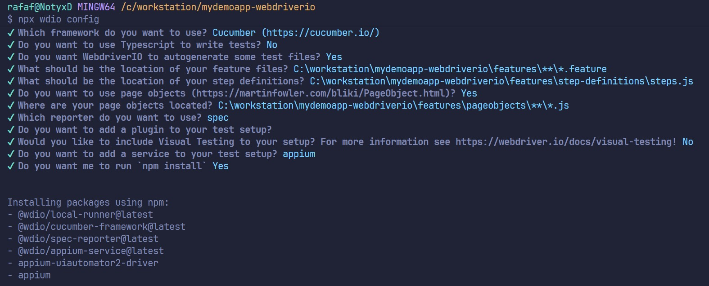

1. Executar este comando:
`npm init wdio@latest .`
2. Escolher as opções de configuração, praticamente tudo padrão

3. Instalar o Appium (para conseguir usar o Appium Inspector com o emulador):
`npm install -g appium`

4. Para executar o servidor do Appium, basta rodar o seguinte comando:
`appium`

5. Definir a variável de ambiente ANDROID_HOME (Dá para pegar indo no Android Studio -> More Actions -> SDK Manager)

6. Importar o arquivo de capabilities para o wdio.conf.js (vide exemplo)

7. Tenha o aplicativo alvo dos testes instalado no emulador

8. Esteja com o emulador aberto

9. Verificar se o caminho dos arquivos de features e steps estão configurados corretamente no wdio.conf.js
 
10. Para executar com o Sauce Labs, instale o seguinte pacote:
`npm install @wdio/sauce-service --save-dev`

11. Ajustar os arquivos de configuração na raiz:
`android.local.conf.js`
`android.sauce.emulator.conf.js`

12. Ajustar o package.json para criar atalhos para executar apontando para 1 dos 2 arquivos de configuração, ao usar o
`npm run nome_do_script`

13. Se for executar utilizando o Sauce Labs, definir as variáveis de ambiente:
`SAUCE_USERNAME`
`SAUCE_ACCESS_KEY`

Foram feitas algumas modificações no After do `comprar_produto.steps.js`, de forma a funcionar tanto no emulador local quanto no emulador no Sauce Labs. Também alteramos a lógica de arrastar a tela no `base.page.js`, para que seja compatível com o Sauce Labs.